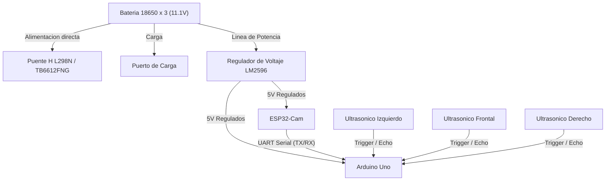
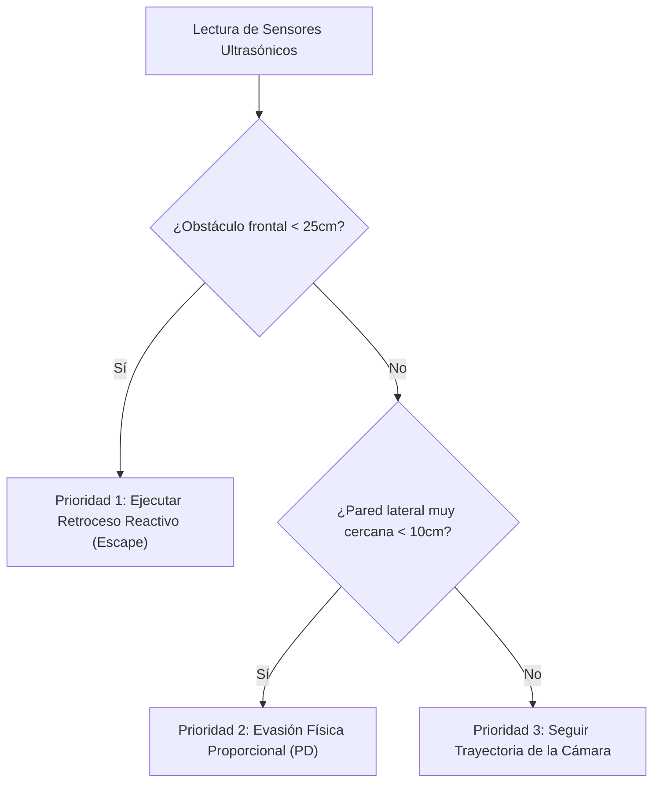

# PEGASUS - WRO Future Engineers 2026

Este repositorio contiene el desarrollo del robot autónomo **TROYA** de nuestro equipo **PEGASUS**, diseñado para competir en la categoría de Futuros Ingenieros en la subcategoría **SENIOR** de la WRO 2026.

---

## 👥 Nuestro Equipo: PEGASUS

Aquí presentamos a los integrantes del equipo **PEGASUS**, responsables del diseño, construcción y programación del robot autónomo **TROYA** para la subcategoría **SENIOR** de la WRO 2026:

*(Sube tu foto de equipo a la carpeta `/t-photos` con el nombre `foto_equipo.jpg` para que se muestre aquí)*

### Integrantes y Roles:

*   **Annabella Paoli**  
    *   **Rol:** Líder de Desarrollo de Software, Visión Artificial y Diseño Mecánico CAD.  
    *   **Contribución:** Responsable del pipeline de visión computacional HSV en la ESP32-Cam, filtrado y calibración de color de los pilares, programación de la máquina de estados y control PD en el Arduino Uno, sincronización de la comunicación asíncrona, modelado 3D del chasis Ackermann de TROYA y reparación elástica de la mangueta con PVC reciclado de alta flexibilidad.
    
*   **Bruno Paoli**  
    *   **Rol:** Líder de Integración Eléctrica, Potencia y Seguridad.  
    *   **Contribución:** Responsable del esquema de conexiones eléctricas, calibración y testeo del regulador de voltaje LM2596, distribución de masa común (GND) y análisis de seguridad del sistema de alimentación de las celdas 18650.

---

## 📁 Estructura del Proyecto

El repositorio está organizado bajo la siguiente estructura limpia para facilitar la navegación de los jueces y el equipo:

*   [**/src**](src): Códigos fuente de competencia para la [ESP32-Cam](src/esp32_vision.ino) (visión artificial) y el [Arduino Uno](src/arduino_control.ino) (control y actuadores).
*   `/schemes`: Diagramas de conexión y diseño de la distribución eléctrica.
*   `/models`: Archivos de diseño en 3D del chasis y piezas personalizadas.
*   `/t-photos`: Registro fotográfico del equipo PEGASUS.
*   `/v-photos`: Registro fotográfico del robot TROYA.
*   `/video`: Archivos y enlaces del video demostrativo de funcionamiento autónomo.
*   `/documentation`: Reportes de ingeniería detallados, bitácora de pruebas y calibración.

---

## 📓 Bitácora de Ingeniería y Resolución de Problemas (Engineering Log)

El desarrollo de **TROYA** ha sido un camino de aprendizaje constante, donde cada fallo mecánico, eléctrico y de software fue tratado como una oportunidad para aplicar el método de diseño en ingeniería. A continuación, documentamos los desafíos más críticos que enfrentamos y cómo los resolvimos.

### ⚙️ 1. Desafíos Mecánicos y Estructurales
#### ❌ La Rotura de la Mangueta Izquierda (Dirección Ackermann)
Durante las pruebas de giro dinámico en el suelo, la fuerza y la presión abrupta ejercidas por el servo motor de dirección quebraron físicamente la mangueta izquierda del chasis. 
*   **Iteración 1 (Fallo):** Intentamos reparar la mangueta utilizando pegamento instantáneo de cianoacrilato, pero la junta se despegó de inmediato ante la primera vibración en el suelo.
*   **Iteración 2 (Fallo):** Aplicamos un adhesivo epóxico de acero (*Pegatanque*). Esto aseguró el cuerpo de la mangueta, pero debido a la extrema rigidez del material, la tensión mecánica se trasladó al punto de unión entre la mangueta y el servo motor, rompiéndose nuevamente en esa zona.
*   **La Solución de Ingeniería:** Evaluamos fabricar la pieza de repuesto en madera o metal, pero presentaban problemas de peso o dificultad de mecanizado. Finalmente, decidimos reciclar **tarjetas de crédito de PVC vencidas**. El PVC resultó ser el material idóneo: es lo suficientemente rígido para mantener la dirección alineada, pero posee la flexibilidad elástica justa para absorber los impactos y la fuerza del servo sin quebrarse.
*   **El Proceso:** Cortamos la mangueta rota sobrante, lijamos la superficie de unión, recortamos la tarjeta de crédito a la medida de la pieza, la adaptamos y la fijamos sólidamente utilizando tornillos autorroscantes. La dirección ahora es sumamente resistente y flexible.

### 🔋 2. Decisiones de Hardware y Energía
#### ⚖️ Selección de Microcontroladores: Arduino Uno + ESP32-Cam vs. Monoplaca
*   **La Decisión:** En lugar de utilizar una computadora de placa única costosa (como Raspberry Pi o OpenMV), decidimos implementar un sistema distribuido de bajo costo con un **Arduino Uno** para el control físico y una **ESP32-Cam** para la visión computacional.
*   **La Razón:** Esta arquitectura cumple al 100% el objetivo de competencia (detectar pilares rojos/verdes y la línea de meta por color) con una fracción del costo y consumo de energía de las alternativas comerciales. Es un prototipo altamente viable, económico y fácil de reparar en pits en caso de fallo.

#### ⚖️ Selección de Energía: 3 celdas Li-ion 18650 (~11.1V) vs. Baterías LiPo
*   **La Decisión:** Optamos por un arreglo de 3 celdas de Litio-Ion 18650 en serie en lugar de una batería de Polímero de Litio (LiPo) estándar de aeromodelismo.
*   **La Razón:** Las celdas 18650 son significativamente más económicas, estables y seguras de manipular en un entorno de taller escolar. Las baterías LiPo requieren cargadores balanceadores costosos y son propensas a hincharse o incendiarse ante cortocircuitos accidentales o sobredescargas, un riesgo físico que preferimos mitigar por seguridad del equipo.

### ⚡ 3. El Incidente Eléctrico: Lecciones de Seguridad
#### ❌ Cortocircuito en el Puerto de Carga Integrado
Originalmente, diseñamos un puerto de carga integrado en el chasis para cargar las baterías directamente sin tener que desmontarlas del robot. Sin embargo, un defecto de aislamiento en las conexiones del puerto provocó un **cortocircuito masivo**. El microcontrolador hizo corto, la placa sufrió daños severos por temperatura y casi experimentamos una explosión de las celdas de litio.
*   **La Decisión de Seguridad:** Este incidente nos hizo profundamente conscientes de los riesgos de la electrónica de potencia sin protecciones. Decidimos **eliminar por completo el puerto de carga integrado** en esta versión física del robot. 
*   **El Protocolo Actual:** Para cargar las celdas 18650 de forma segura, las retiramos físicamente del coche utilizando portabaterías con resortes y las cargamos de manera externa en un cargador inteligente auxiliar con corte automático de energía.

### 💻 4. Desafíos de Software y Arquitectura
#### ❌ Conflicto de Timers entre el Servo y el Pin 10 (`ENA`)
Al conectar el pin de habilitación del Puente H (`ENA`) al pin 10 del Arduino para controlar la velocidad del carro, descubrimos que el motor trasero no giraba en absoluto cuando el servo del timón (Pin 9) estaba activo.
*   **La Causa Técnica:** La librería estándar `Servo.h` de Arduino toma el control absoluto del **Timer 1** del microcontrolador ATmega328P para generar los pulsos del servo. Al hacer esto, **deshabilita por completo la función `analogWrite()` (PWM) en los pines 9 y 10**. El Arduino simplemente ignoraba las órdenes de velocidad del motor.
*   **La Solución:** Colocamos físicamente el jumper de plástico negro en el Puente H para dejar el pin `ENA` conectado permanentemente a 5V (HIGH físico). De esta forma, liberamos el pin 10 y reescribimos el software para controlar la velocidad mediante PWM en el **Pin 11 (`IN2`)**, el cual utiliza el **Timer 2** y no tiene ningún conflicto con el servo.

#### ❌ El Bug del "Coche Zombie" (Desbordamiento de SoftwareSerial)
Durante las pruebas de ultrasonido, añadimos retrasos de `delay(15)` entre la lectura de cada sensor para evitar interferencia de ondas. Sin embargo, al hacer esto, el carro comenzó a avanzar recto de largo, ignorando por completo las paredes y chocando sin detenerse de forma aleatoria.
*   **La Causa Técnica:** Al sumar los delays de los sensores, el ciclo principal (`loop`) tardaba más de 55 ms en ejecutarse. A una velocidad de 38400 baudios, la ESP32-Cam envía datos tan rápido que el búfer de recepción de `SoftwareSerial` del Arduino (que solo tiene 64 bytes de capacidad) **se desbordaba constantemente**. Esto corrompía los paquetes de datos serie, haciendo que la función `sscanf` interpretara valores basura y corrompiera la memoria RAM (Stack Corruption) del Arduino Uno. El coche de pruebas entraba en un estado "zombie" ignorando las condicionales lógicas de los sensores.
*   **La Solución:** Eliminamos todos los delays intermedios de los ultrasonidos y agregamos un filtro estricto de seguridad `sscanf == 4`. El Arduino ahora solo procesa los datos de la cámara si la trama de datos serie recibida contiene exactamente los 4 enteros del protocolo, de lo contrario la descarta, garantizando que el búfer nunca se sature y que el procesador ejecute el lazo de control con total fluidez.

### 🔊 5. Desafíos de Física de Sensores
#### ❌ Absorción Acústica de la Tela (El Misterio del Cobertor)
Durante las pruebas de frenado frontal en casa, descubrimos que el robot esquivaba perfectamente cajas de cartón o carpetas duras, pero **se estrellaba y se quedaba pegado empujando el cobertor de tela de los muebles**.
*   **La Causa Física:** Los sensores ultrasónicos (HC-SR04) miden distancia enviando ondas de sonido que deben rebotar en una superficie dura. Las superficies textiles y blandas (como los cobertores de tela, cortinas o colchas) actúan como **aislantes acústicos**, absorbiendo la onda de sonido en lugar de reflejarla. Al no recibir el eco de rebote, el sensor retornaba una lectura máxima de `300 cm` (camino libre), haciendo que el carro avanzara ciego contra el obstáculo de tela.
*   **La Solución:** Establecimos la regla de calibración de probar el robot **únicamente contra superficies duras** (madera, cartón, plástico), que son los materiales reales de los muros y obstáculos de la pista oficial de la WRO.

#### ❌ Atasque por Fricción en Zonas Estrechas (Stall a 85 PWM)
Al entrar en pasillos angostos, el robot comenzaba a corregir su dirección constantemente y, de pronto, se quedaba completamente quieto y en silencio a mitad de carril, a pesar de tener espacio libre al frente.
*   **La Causa Física:** En las zonas estrechas, el lazo PD genera giros de dirección muy pronunciados. En un chasis con dirección Ackermann, doblar las ruedas delanteras con fuerza incrementa dramáticamente la **resistencia a la rodadura (fricción)** del carro. En nuestro algoritmo de curvas, permitíamos que la velocidad mínima bajara hasta `85` PWM. Esa potencia era demasiado baja para vencer el peso del chasis y la resistencia mecánica de las ruedas dobladas al mismo tiempo, provocando que el motor de tracción trasera sufriera un bloqueo por torque (*stall*).
*   **La Solución:** Ajustamos el software para establecer un límite de velocidad mínima en curvas de **`105` PWM**. Este voltaje extra le proporciona al motor el torque necesario para empujar el chasis con las ruedas delantera dobladas al extremo sin antes atascarse.

---

## 🔌 Arquitectura del Sistema (Hardware)

**TROYA** utiliza una arquitectura de procesamiento distribuido para maximizar la eficiencia de los recursos de bajo costo:

*   **ESP32-Cam:** Dedicada exclusivamente al procesamiento de visión computacional y toma de decisiones lógicas de alto nivel.
*   **Arduino Uno:** Dedicado al control en tiempo real de los actuadores (motor DC y servo dirección) y a la lectura síncrona de los sensores de distancia ultrasónicos.

### Diagrama de Bloques del Hardware

El siguiente diagrama detalla la distribución de energía (partiendo de una configuración de 3 baterías 18650 que entregan un voltaje nominal de ~11.1V) y el flujo de señales de control:

### 💻 Lógica de Control y Navegación Autónoma

El sistema de control de TROYA utiliza un enfoque de fusión de sensores y un controlador Proporcional-Derivativo (PD) para resolver de forma estable los desafíos de navegación, evasión de obstáculos y estacionamiento en un chasis con dirección tipo Ackermann.

1. Fusión de Sensores y Prioridades de Control
Para evitar colisiones causadas por posibles caídas en la tasa de refresco (FPS) de la cámara, el Arduino Uno evalúa constantemente el entorno con sensores de distancia de forma prioritaria:

Si no hay riesgos físicos inmediatos detectados por los sensores de distancia, la lógica delega el guiado del carro al procesamiento visual de la cámara:

### 🛣️ 2. Algoritmos de Navegación y Maniobras en Pista

#### 🟢 Mantenimiento de Carril Inteligente (Lane Keeping)
El robot navega de forma fluida utilizando un lazo de control **Proporcional-Derivativo (PD)** que calcula constantemente la desviación respecto al centro de las paredes utilizando los sensores ultrasónicos izquierdo y derecho.

*   **Fórmulas aplicadas:**  
    `Error = Distancia_Derecha - Distancia_Izquierda`  
    `Corrección_PD = (Error * Kp) + ((Error - Último_Error) * Kd)`
*   La variable `Kd` actúa como amortiguador de la dirección, eliminando por completo el balanceo lateral (*zig-zag*) y asegurando un avance recto y sumamente estable.

#### 🎯 Evasión de Pilares por Cámara (Active Dodging)
Cuando la ESP32-Cam detecta la presencia de un pilar de color dentro de su Región de Interés (ROI), desactiva temporalmente el centrado por ultrasonidos y asume el control del volante aplicando giros agresivos y cerrados según el color del pilar, respetando el reglamento oficial de la WRO:
*   **Pilar Rojo:** El carro gira con fuerza hacia la **Derecha** (ángulo entre 110° y 130°).
*   **Pilar Verde:** El carro gira con fuerza hacia la **Izquierda** (ángulo entre 50° y 70°).
*   **Desaceleración Activa:** Para garantizar que el timón Ackermann tenga suficiente agarre en las llantas de hule del chasis y doble sin derrapar (*subviraje*), el Arduino reduce inmediatamente la velocidad del motor de tracción trasera a **`95` PWM** durante toda la evasión.
*   **Tiempo de Retención (Evasion Hold-Time):** Una vez que el pilar sale del campo visual de la cámara, el Arduino mantiene el timón doblado a tope durante **300 milisegundos más** para asegurar que la cola del carro libre físicamente el obstáculo antes de regresar al centrado por ultrasonido.

#### 🔄 Giro de Retorno Autónomo (U-Turn)
En la tercera vuelta del circuito, si la cámara detecta la señal roja de intersección, envía la señal de activación `comandoEspecial = 3`. El Arduino interrumpe inmediatamente el centrado de carril, dobla la dirección al máximo hacia la izquierda (`50°`) y avanza a velocidad regulada de `80` PWM durante exactamente **1.3 segundos** para completar un giro perfecto de 180° dentro del carril ancho de la pista, reanudando la marcha normal tras finalizar el temporizador.

#### 🚗 Maniobra de Estacionamiento en Reversa (Diagonal Parallel Parking)
Al finalizar la tercera vuelta de competencia (`contadorVueltas >= 3`), el robot reduce su velocidad de avance a `55` PWM e inicia la secuencia autónoma de parqueo de 4 fases utilizando los sensores ultrasónicos laterales para detectar la apertura del cajón:
*   **Fase 0 (Búsqueda):** Avanza despacio pegado a la derecha. Si el sensor derecho detecta un hueco en la pared (`distDer > 35 cm`) **Y** la cámara confirma el color de la zona de parqueo (`comandoEspecial == 4`), inicia la maniobra física.
*   **Fase 1 (Alineación):** Avanza recto de frente durante **800 milisegundos** para que el eje trasero del carro libre físicamente la esquina del cajón de estacionamiento.
*   **Fase 2 (Entrada en Reversa):** Gira el volante a tope derecho (`130°`) y retrocede de forma dócil y controlada por PWM a **`-120` PWM** durante **1.2 segundos** para meter la parte trasera en el cajón.
*   **Fase 3 (Alineación Paralela):** Gira el volante a tope izquierdo (`50°`) y continúa retrocediendo en reversa para meter la trompa del coche y alinearlo en paralelo a las paredes. La reversa se apaga inmediatamente si el sensor frontal detecta que el carro ya se alineó de frente o por un temporizador de seguridad de **1.0 segundo**.
*   **Fase 4 (Detenido):** Transiciona al estado `DETENIDO`, centrando el servo a `90°` y apagando por completo el motor de tracción.

---

### 📷 3. Estrategia de Visión: Densidad y Saturación de Color vs. Punto Único

Las variaciones de iluminación en la pista de competencia suelen descalibrar los sensores de color tradicionales o los algoritmos de detección basados en un solo píxel (punto único).

Para resolver este desafío, el pipeline de la ESP32-Cam de **TROYA** analiza la **densidad y opacidad de los colores en el espacio HSV**:

*   **Filtro por Umbral de Saturación (S) y Valor (V):** Al convertir la imagen de RGB a HSV, aislamos los cambios de brillo de la pista. El canal de saturación nos permite identificar la pureza y densidad del color (naranja, azul, rojo o verde) sin importar si la zona está iluminada directamente o bajo sombra.
*   **Densidad de Región (Blobs):** Se define una Región de Interés (ROI). El algoritmo calcula el área del contorno binarizado (cantidad de píxeles activos dentro de una máscara). Si la densidad de píxeles supera un umbral mínimo configurado, el objeto se clasifica como obstáculo válido.
*   **Centro de Masa (Centroide):** En lugar de seguir el borde del objeto, calculamos el centroide matemático de la masa de color detectada. Esto reduce el "ruido visual" de la imagen y proporciona una coordenada estable para el cálculo del error de dirección del chasis.
