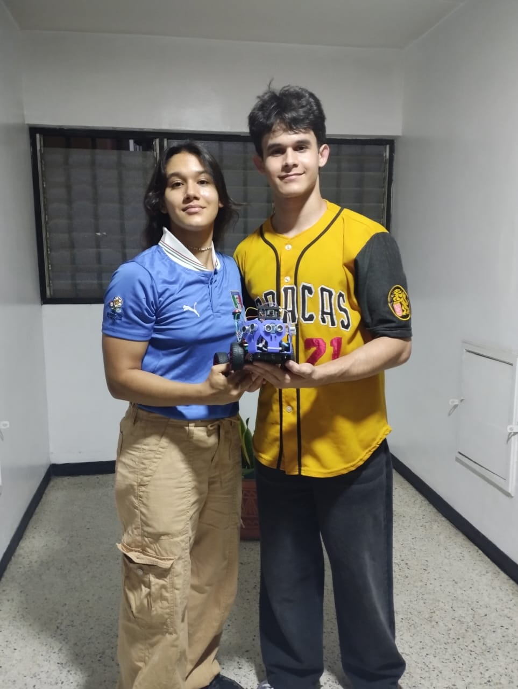
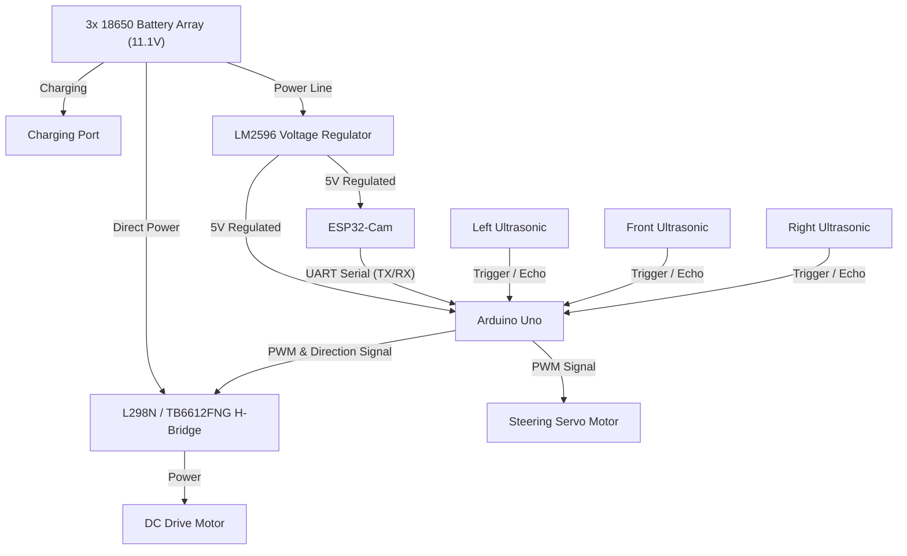
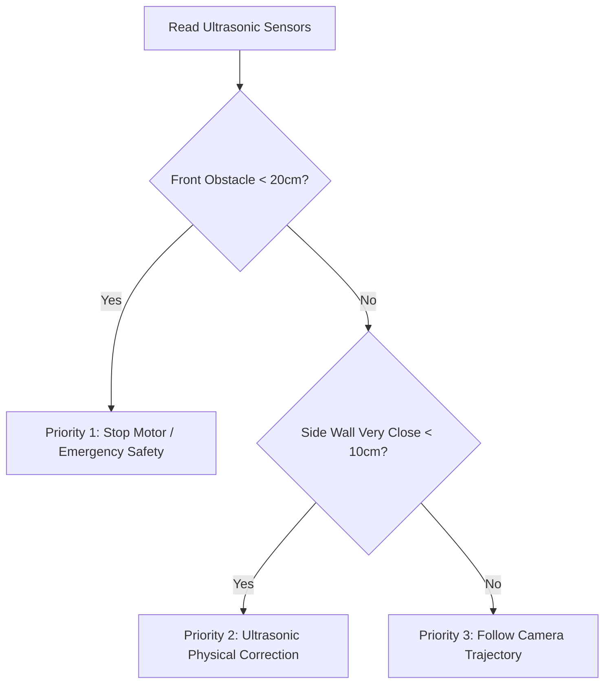
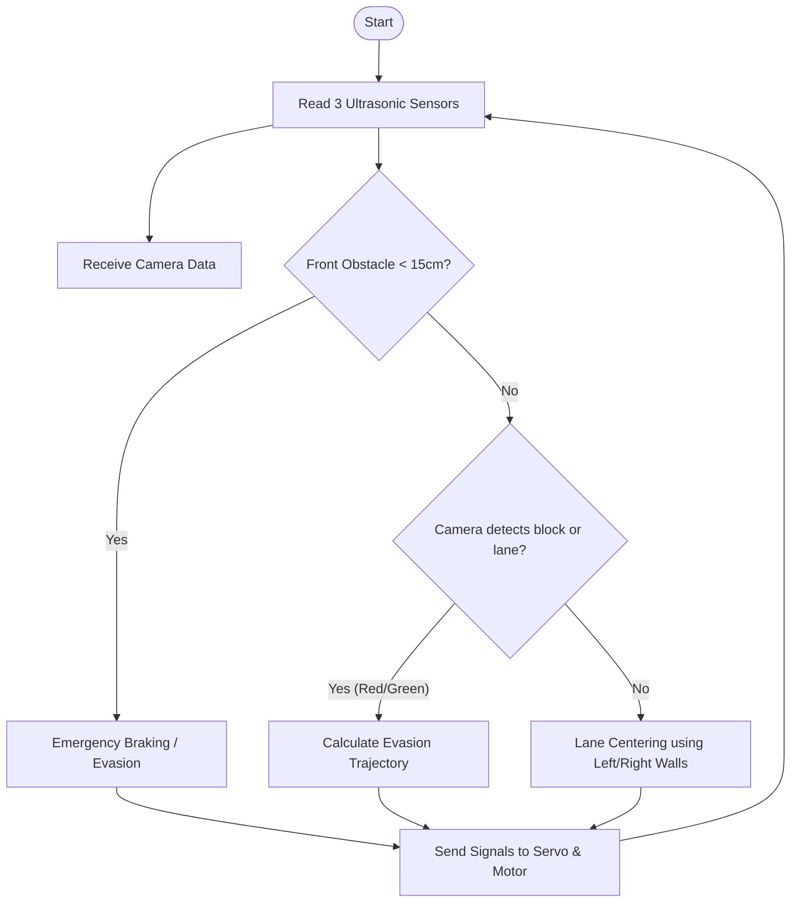

# PEGASUS - WRO Future Engineers 2026

This repository contains the development of the autonomous robot **TROYA** by team **PEGASUS**, designed to compete in the Future Engineers category in the **SENIOR** subcategory of WRO 2026.

## 👥 Our Team: PEGASUS

Here we present the members of team **PEGASUS**, responsible for the design, construction, and programming of the autonomous robot **TROYA** for the WRO 2026 **SENIOR** subcategory:

### Members and Roles:

*   **Annabella Paoli**   
    *   **Role:** Software & Computer Vision Lead | Mechanical & Chassis Design Lead
    *   **Contribution:** Responsible for the HSV computer vision pipeline on the ESP32-Cam, pillar color calibration, PD control programming on the Arduino Uno, and asynchronous serial communication synchronization. Responsible for the 3D structural design of TROYA's Ackermann chassis and the repair of the high-flexibility PVC steering knuckle.
    

*   **Bruno Paoli**   
    *   **Role:** Electrical Integration, Power & Safety Lead  
    *   **Contribution:** Responsible for the electrical connection schematics, calibration and testing of the LM2596 voltage regulator, common ground (GND) distribution, and safety analysis of the 18650 battery cell power supply system.

---

## 📁 Project Structure

The repository is organized under the following clean structure to facilitate navigation for the judges and the team:

*   `/src`: Source code for the ESP32-Cam (computer vision) and Arduino Uno (control and actuators).
*   `/schemes`: Connection diagrams and electrical distribution layout.
*   `/models`: 3D design files for the chassis and custom parts.
*   `/t-photos`: Photo log of team PEGASUS.
*   `/v-photos`: Photo log of the robot TROYA.
*   `/video`: Files and links to the demonstration video of autonomous operation.
*   `/documentation`: Detailed engineering reports, test log, and calibration records.

---

## 📓 Engineering Log & Troubleshooting

The development of **TROYA** has been a journey of continuous learning, where every mechanical, electrical, and software failure was treated as an opportunity to apply the engineering design process. Below, we document the most critical challenges we faced and how we solved them.

### ⚙️ 1. Mechanical and Structural Challenges
#### ❌ Left Steering Knuckle Breakage (Ackermann Steering)
During dynamic floor turn testing, the abrupt force and pressure exerted by the steering servo motor physically broke the left steering knuckle of the chassis. 
*   **Iteration 1 (Failure):** We attempted to repair the steering knuckle using cyanoacrylate instant glue, but the joint detached immediately upon the first vibration on the floor.
*   **Iteration 2 (Failure):** We applied a steel epoxy adhesive (*Pegatanque*). This secured the body of the steering knuckle, but due to the extreme rigidity of the material, mechanical stress shifted to the joint between the knuckle and the servo motor, breaking again in that area.
*   **The Engineering Solution:** We evaluated manufacturing a replacement part out of wood or metal, but they presented issues with weight or machining difficulty. Finally, we decided to recycle **expired PVC credit cards**. PVC proved to be the ideal material: it is rigid enough to keep the steering aligned, yet possesses just the right amount of elastic flexibility to absorb impacts and servo forces without snapping.
*   **The Process:** We trimmed the remaining broken knuckle, sanded the joining surface, cut the credit card to the size of the part, adapted it, and firmly secured it using self-tapping screws. The steering mechanism is now extremely durable and flexible.

### 🔋 2. Hardware and Power Decisions
#### ⚖️ Microcontroller Selection: Arduino Uno + ESP32-Cam vs. Single Board Computer
*   **The Decision:** Instead of using an expensive single-board computer (such as a Raspberry Pi or OpenMV), we decided to implement a low-cost distributed system using an **Arduino Uno** for low-level control and an **ESP32-Cam** for computer vision.
*   **The Reason:** This architecture fulfills 100% of the competition goals (detecting red/green pillars and the finish line by color) at a fraction of the cost and power consumption of commercial alternatives. It is a highly viable, economical prototype that is easy to repair in the pits in case of failure.

#### ⚖️ Power Selection: 3 Li-ion 18650 Cells (~11.1V) vs. LiPo Batteries
*   **The Decision:** We opted for an array of 3 Lithium-Ion 18650 cells in series rather than a standard model aviation Lithium Polymer (LiPo) battery.
*   **The Reason:** 18650 cells are significantly cheaper, more stable, and safer to handle in a school workshop environment. LiPo batteries require expensive balance chargers and are prone to swelling or catching fire in the event of accidental short circuits or over-discharges—a physical risk we preferred to mitigate for team safety.

### ⚡ 3. The Electrical Incident: Safety Lessons
#### ❌ Short Circuit in the Integrated Charging Port
Originally, we designed an integrated charging port on the chassis to charge the batteries directly without having to remove them from the robot. However, an insulation defect in the port's connections caused a **massive short circuit**. The microcontroller shorted out, the board suffered severe thermal damage, and we nearly experienced a lithium cell thermal runaway.
*   **The Safety Decision:** This incident made us acutely aware of the risks involved in un-protected power electronics. We decided to **completely eliminate the integrated charging port** in this physical version of the robot. 
*   **Current Protocol:** To safely charge the 18650 cells, we physically remove them from the car using spring-loaded battery holders and charge them externally using an auxiliary smart charger with automatic power cut-off.

### 💻 4. Software and Architecture Challenges
#### ❌ Timer Conflict Between Servo and Pin 10 (`ENA`)
When connecting the H-Bridge enable pin (`ENA`) to Arduino Pin 10 to control the car's speed, we discovered that the rear motor did not spin at all when the steering servo (Pin 9) was active.
*   **The Technical Cause:** Arduino's standard `Servo.h` library takes exclusive control of **Timer 1** on the ATmega328P microcontroller to generate servo pulses. In doing so, it **completely disables the `analogWrite()` (PWM) functionality on Pins 9 and 10**. The Arduino simply ignored motor speed commands.
*   **The Solution:** We physically placed the black plastic jumper on the H-Bridge to keep the `ENA` pin permanently connected to 5V (physical HIGH). This freed up Pin 10, and we rewrote the software to control speed via PWM on **Pin 11 (`IN2`)**, which utilizes **Timer 2** and has no conflict with the servo.

#### ❌ The "Zombie Car" Bug (SoftwareSerial Overflow)
During ultrasonic testing, we added `delay(15)` pauses between reading each sensor to avoid wave interference. However, upon doing this, the car began driving straight endlessly, completely ignoring walls and crashing randomly without stopping.
*   **The Technical Cause:** Adding up sensor delays caused the main loop (`loop`) to take over 55 ms to execute. At a baud rate of 38400, the ESP32-Cam sends data so quickly that Arduino's `SoftwareSerial` receive buffer (which only has a 64-byte capacity) **overflowed continuously**. This corrupted the serial data packets, causing the `sscanf` function to interpret garbage values and corrupt the Arduino Uno's RAM memory (Stack Corruption). The car entered a "zombie" state, ignoring sensor logic conditions.
*   **The Solution:** We removed all intermediate ultrasonic delays and added a strict safety filter `sscanf == 4`. The Arduino now only processes camera data if the received serial packet contains exactly the 4 protocol integers; otherwise, it discards it, guaranteeing the buffer never saturates and the processor executes the control loop smoothly.

### 🔊 5. Sensor Physics Challenges
#### ❌ Acoustic Absorption of Fabric (The Furniture Cover Mystery)
During frontal braking tests at home, we discovered that the robot perfectly dodged cardboard boxes and hard folders, but **crashed and got stuck pushing against fabric furniture covers**.
*   **The Physical Cause:** Ultrasonic sensors (HC-SR04) measure distance by sending sound waves that must bounce off a hard surface. Textile and soft surfaces (such as fabric covers, curtains, or blankets) act as **acoustic insulators**, absorbing the sound wave instead of reflecting it. Receiving no echo return, the sensor returned a maximum reading of `300 cm` (clear path), causing the car to drive blind into the fabric obstacle.
*   **The Solution:** We established the calibration rule of testing the robot **exclusively against hard surfaces** (wood, cardboard, plastic), which are the actual materials used for walls and obstacles in the official WRO track.

#### ❌ Friction Stall in Narrow Zones (Stall at 85 PWM)
Upon entering narrow passages, the robot began constantly correcting its steering and suddenly came to a complete, silent stop mid-lane, despite having open space ahead.
*   **The Physical Cause:** In narrow zones, the PD loop generates very sharp steering corrections. On an Ackermann steering chassis, turning the front wheels sharply increases **rolling resistance (friction)** dramatically. In our cornering algorithm, we allowed the minimum speed to drop as low as `85` PWM. This power was too low to overcome both the chassis weight and the mechanical resistance of fully turned wheels at the same time, causing the rear drive motor to suffer a torque stall.
*   **The Solution:** We adjusted the software to set a minimum speed limit in curves of **`105` PWM**. This extra voltage provides the motor with the necessary torque to push the chassis with fully turned front wheels without stalling.

---

## 🔌 System Architecture (Hardware)

**TROYA** uses a distributed processing architecture to maximize the efficiency of low-cost hardware resources:

*   **ESP32-Cam:** Exclusively dedicated to computer vision processing and high-level logical decision-making.
*   **Arduino Uno:** Dedicated to real-time actuator control (DC motor and steering servo) and synchronous distance reading from ultrasonic sensors.

### Hardware Block Diagram

The following diagram details the power distribution (starting from a 3-cell 18650 battery setup delivering a nominal voltage of ~11.1V) and control signal flow:

### Control Logic and Autonomous Navigation

TROYA's control system employs a sensor fusion and proportional (P) control approach to reliably handle navigation, obstacle avoidance, and parking challenges on an Ackermann-steering chassis.

1. Sensor Fusion and Control Priorities
To optimize the use of limited hardware resources (Arduino Uno and ESP32-Cam), a distributed control architecture with assigned priorities was implemented:

* **Vision Processing (ESP32-Cam)**: Responsible for color classification of obstacles (red/green) and proposing turn trajectories based on detected colors.

* **Safety & Distance Control (Arduino Uno)**: Reads the 3 ultrasonic sensors in real time for millimeter-accurate centering relative to side walls and acts as an autonomous emergency braking system if camera lag occurs.

The priority flow executes under the following criteria:

If no immediate physical risks are detected by the distance sensors, movement control is delegated to the logical decisions processed by the camera.

The robot combines visual readings from the ESP32-Cam with distances measured by the three ultrasonic sensors to navigate safely.