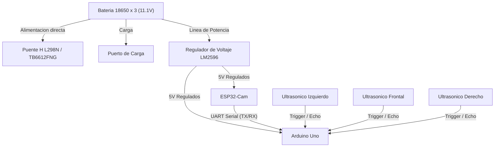
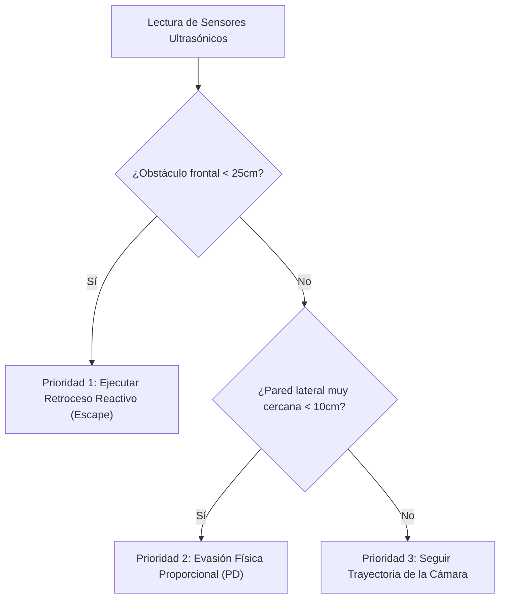
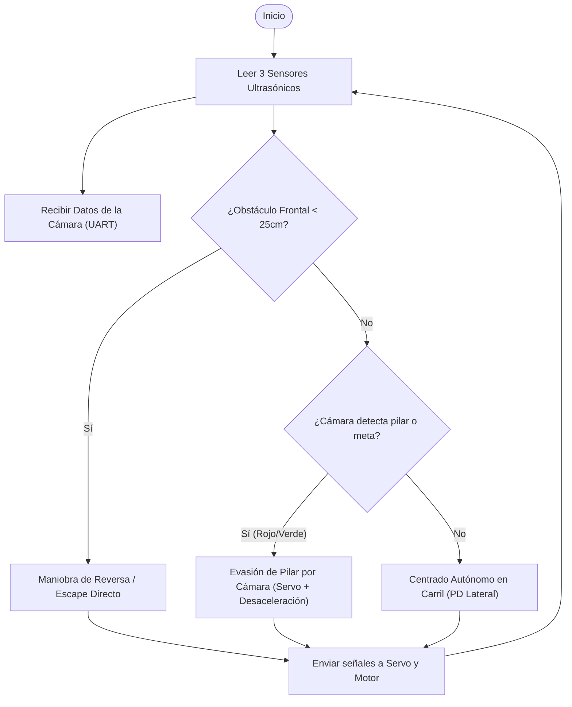

# PEGASUS - WRO Future Engineers 2026

Este repositorio contiene el desarrollo del robot autónomo **TROYA** de nuestro equipo **PEGASUS**, diseñado para competir en la categoría de Futuros Ingenieros en la subcategoría **SENIOR** de la WRO 2026.

---

## 👥 Nuestro Equipo: PEGASUS

Aquí presentamos a los integrantes del equipo **PEGASUS**, responsables del diseño, construcción y programación del robot autónomo **TROYA** para la subcategoría **SENIOR** de la WRO 2026:

*(Sube tu foto de equipo a la carpeta `/t-photos` con el nombre `foto_equipo.jpg` para que se muestre aquí)*

### Integrantes y Roles:

*   **Annabella Paoli**  
    *   **Rol:** Líder de Desarrollo de Software, Visión Artificial y Diseño Mecánico CAD.  
    *   **Contribución:** Responsable del pipeline de visión computacional HSV en la ESP32-Cam, filtrado y calibración de color de los pilares, programación de la máquina de estados y control PD en el Arduino Uno, sincronización de la comunicación asíncrona, modelado 3D del chasis Ackermann de TROYA y reparación elástica de la mangueta con PVC reciclado de alta flexibilidad.
    
*   **Bruno Paoli**  
    *   **Rol:** Líder de Integración Eléctrica, Potencia y Seguridad.  
    *   **Contribución:** Responsable del esquema de conexiones eléctricas, calibración y testeo del regulador de voltaje LM2596, distribución de masa común (GND) y análisis de seguridad del sistema de alimentación de las celdas 18650.

---

## 📁 Estructura del Proyecto

El repositorio está organizado bajo la siguiente estructura limpia para facilitar la navegación de los jueces y el equipo:

*   [**/src**](src): Códigos fuente de competencia para la [ESP32-Cam](src/esp32_vision.ino) (visión artificial) y el [Arduino Uno](src/arduino_control.ino) (control y actuadores).
*   `/schemes`: Diagramas de conexión y diseño de la distribución eléctrica.
*   `/models`: Archivos de diseño en 3D del chasis y piezas personalizadas.
*   `/t-photos`: Registro fotográfico del equipo PEGASUS.
*   `/v-photos`: Registro fotográfico del robot TROYA.
*   `/video`: Archivos y enlaces del video demostrativo de funcionamiento autónomo.
*   `/documentation`: Reportes de ingeniería detallados, bitácora de pruebas y calibración.

---

## 📓 Bitácora de Ingeniería y Lecciones Aprendidas (Resumen)

El diseño de **TROYA** ha sido un proceso iterativo de resolución de problemas reales mediante el método de diseño en ingeniería. Enfrentamos y superamos desafíos estructurales, eléctricos y de software que maduraron nuestro prototipo de competencia:

*   **🔧 Reparación Elástica de Dirección:** Solucionamos la rotura constante de la mangueta izquierda de Ackermann diseñando un soporte de PVC reciclado de tarjetas de crédito, proporcionando la combinación perfecta de rigidez y flexibilidad mecánica.
*   **⚡ Remoción del Puerto de Carga por Cortocircuito:** Tras sufrir un cortocircuito masivo que dañó componentes en las pruebas del puerto integrado, decidimos priorizar la seguridad del robot migrando a un protocolo de carga externa balanceada con portabaterías de extracción física.
*   **💻 Solución al Conflicto de Timers (Pin 10):** Resolvimos el bloqueo de tracción reconfigurando la dirección del Puente H mediante PWM en el Pin 11 (Timer 2), evitando el conflicto de hardware de la librería de Servos que tomaba el control absoluto del Timer 1 en el Pin 10.
*   **🔊 Física de Sensores e Interferencias:** Diseñamos un cooldown de seguridad de 1.5s en software para evitar que la interferencia electromagnética (EMI) de la reversa bloqueara a los sensores ultrasónicos, y aprendimos a calibrar el software ante la absorción acústica de los materiales textiles.

---

### 📖 Reporte de Ingeniería y Bitácora Completa
Para conocer los detalles matemáticos de la calibración, el análisis de causas raíz de los fallos, los esquemas de descarte y el diario completo de desarrollo de nuestro equipo:

👉 **[Haz clic aquí para leer nuestra Bitácora de Ingeniería y Reporte de Desarrollo Completo](documation/bitacora_creacion_prototipo.md)**
---

## 🔌 Arquitectura del Sistema (Hardware)

**TROYA** utiliza una arquitectura de procesamiento distribuido para maximizar la eficiencia de los recursos de bajo costo:

*   **ESP32-Cam:** Dedicada exclusivamente al procesamiento de visión computacional y toma de decisiones lógicas de alto nivel.
*   **Arduino Uno:** Dedicado al control en tiempo real de los actuadores (motor DC y servo dirección) y a la lectura síncrona de los sensores de distancia ultrasónicos.

### Diagrama de Bloques del Hardware

El siguiente diagrama detalla la distribución de energía (partiendo de una configuración de 3 baterías 18650 que entregan un voltaje nominal de ~11.1V) y el flujo de señales de control:

### 💻 Lógica de Control y Navegación Autónoma

El sistema de control de TROYA utiliza un enfoque de fusión de sensores y un controlador Proporcional-Derivativo (PD) para resolver de forma estable los desafíos de navegación, evasión de obstáculos y estacionamiento en un chasis con dirección tipo Ackermann.

1. Fusión de Sensores y Prioridades de Control
Para evitar colisiones causadas por posibles caídas en la tasa de refresco (FPS) de la cámara, el Arduino Uno evalúa constantemente el entorno con sensores de distancia de forma prioritaria:

Si no hay riesgos físicos inmediatos detectados por los sensores de distancia, la lógica delega el guiado del carro al procesamiento visual de la cámara:

### 🛣️ 2. Algoritmos de Navegación y Maniobras en Pista

#### 🟢 Mantenimiento de Carril Inteligente (Lane Keeping)
El robot navega de forma fluida utilizando un lazo de control **Proporcional-Derivativo (PD)** que calcula constantemente la desviación respecto al centro de las paredes utilizando los sensores ultrasónicos izquierdo y derecho.

*   **Fórmulas aplicadas:**  
    `Error = Distancia_Derecha - Distancia_Izquierda`  
    `Corrección_PD = (Error * Kp) + ((Error - Último_Error) * Kd)`
*   La variable `Kd` actúa como amortiguador de la dirección, eliminando por completo el balanceo lateral (*zig-zag*) y asegurando un avance recto y sumamente estable.

#### 🎯 Evasión de Pilares por Cámara (Active Dodging)
Cuando la ESP32-Cam detecta la presencia de un pilar de color dentro de su Región de Interés (ROI), desactiva temporalmente el centrado por ultrasonidos y asume el control del volante aplicando giros agresivos y cerrados según el color del pilar, respetando el reglamento oficial de la WRO:
*   **Pilar Rojo:** El carro gira con fuerza hacia la **Derecha** (ángulo entre 110° y 130°).
*   **Pilar Verde:** El carro gira con fuerza hacia la **Izquierda** (ángulo entre 50° y 70°).
*   **Desaceleración Activa:** Para garantizar que el timón Ackermann tenga suficiente agarre en las llantas de hule del chasis y doble sin derrapar (*subviraje*), el Arduino reduce inmediatamente la velocidad del motor de tracción trasera a **`95` PWM** durante toda la evasión.
*   **Tiempo de Retención (Evasion Hold-Time):** Una vez que el pilar sale del campo visual de la cámara, el Arduino mantiene el timón doblado a tope durante **300 milisegundos más** para asegurar que la cola del carro libre físicamente el obstáculo antes de regresar al centrado por ultrasonido.

#### 🔄 Giro de Retorno Autónomo (U-Turn)
En la tercera vuelta del circuito, si la cámara detecta la señal roja de intersección, envía la señal de activación `comandoEspecial = 3`. El Arduino interrumpe inmediatamente el centrado de carril, dobla la dirección al máximo hacia la izquierda (`50°`) y avanza a velocidad regulada de `80` PWM durante exactamente **1.3 segundos** para completar un giro perfecto de 180° dentro del carril ancho de la pista, reanudando la marcha normal tras finalizar el temporizador.

#### 🚗 Maniobra de Estacionamiento en Reversa (Diagonal Parallel Parking)
Al finalizar la tercera vuelta de competencia (`contadorVueltas >= 3`), el robot reduce su velocidad de avance a `55` PWM e inicia la secuencia autónoma de parqueo de 4 fases utilizando los sensores ultrasónicos laterales para detectar la apertura del cajón:
*   **Fase 0 (Búsqueda):** Avanza despacio pegado a la derecha. Si el sensor derecho detecta un hueco en la pared (`distDer > 35 cm`) **Y** la cámara confirma el color de la zona de parqueo (`comandoEspecial == 4`), inicia la maniobra física.
*   **Fase 1 (Alineación):** Avanza recto de frente durante **800 milisegundos** para que el eje trasero del carro libre físicamente la esquina del cajón de estacionamiento.
*   **Fase 2 (Entrada en Reversa):** Gira el volante a tope derecho (`130°`) y retrocede de forma dócil y controlada por PWM a **`-120` PWM** durante **1.2 segundos** para meter la parte trasera en el cajón.
*   **Fase 3 (Alineación Paralela):** Gira el volante a tope izquierdo (`50°`) y continúa retrocediendo en reversa para meter la trompa del coche y alinearlo en paralelo a las paredes. La reversa se apaga inmediatamente si el sensor frontal detecta que el carro ya se alineó de frente o por un temporizador de seguridad de **1.0 segundo**.
*   **Fase 4 (Detenido):** Transiciona al estado `DETENIDO`, centrando el servo a `90°` y apagando por completo el motor de tracción.

---

### 📷 3. Estrategia de Visión: Densidad y Saturación de Color vs. Punto Único

Las variaciones de iluminación en la pista de competencia suelen descalibrar los sensores de color tradicionales o los algoritmos de detección basados en un solo píxel (punto único).

Para resolver este desafío, el pipeline de la ESP32-Cam de **TROYA** analiza la **densidad y opacidad de los colores en el espacio HSV**:

*   **Filtro por Umbral de Saturación (S) y Valor (V):** Al convertir la imagen de RGB a HSV, aislamos los cambios de brillo de la pista. El canal de saturación nos permite identificar la pureza y densidad del color (naranja, azul, rojo o verde) sin importar si la zona está iluminada directamente o bajo sombra.
*   **Densidad de Región (Blobs):** Se define una Región de Interés (ROI). El algoritmo calcula el área del contorno binarizado (cantidad de píxeles activos dentro de una máscara). Si la densidad de píxeles supera un umbral mínimo configurado, el objeto se clasifica como obstáculo válido.
*   **Centro de Masa (Centroide):** En lugar de seguir el borde del objeto, calculamos el centroide matemático de la masa de color detectada. Esto reduce el "ruido visual" de la imagen y proporciona una coordenada estable para el cálculo del error de dirección del chasis.
